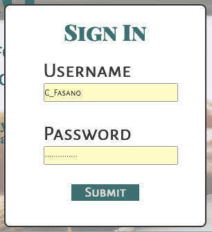
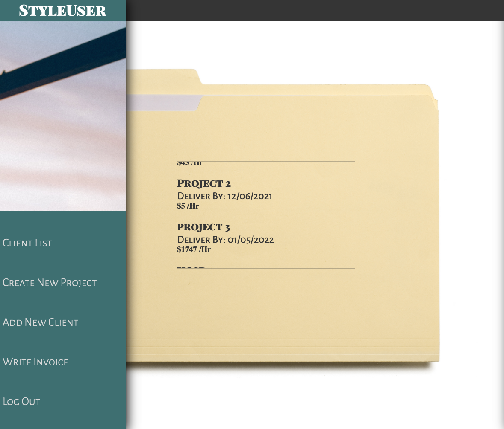
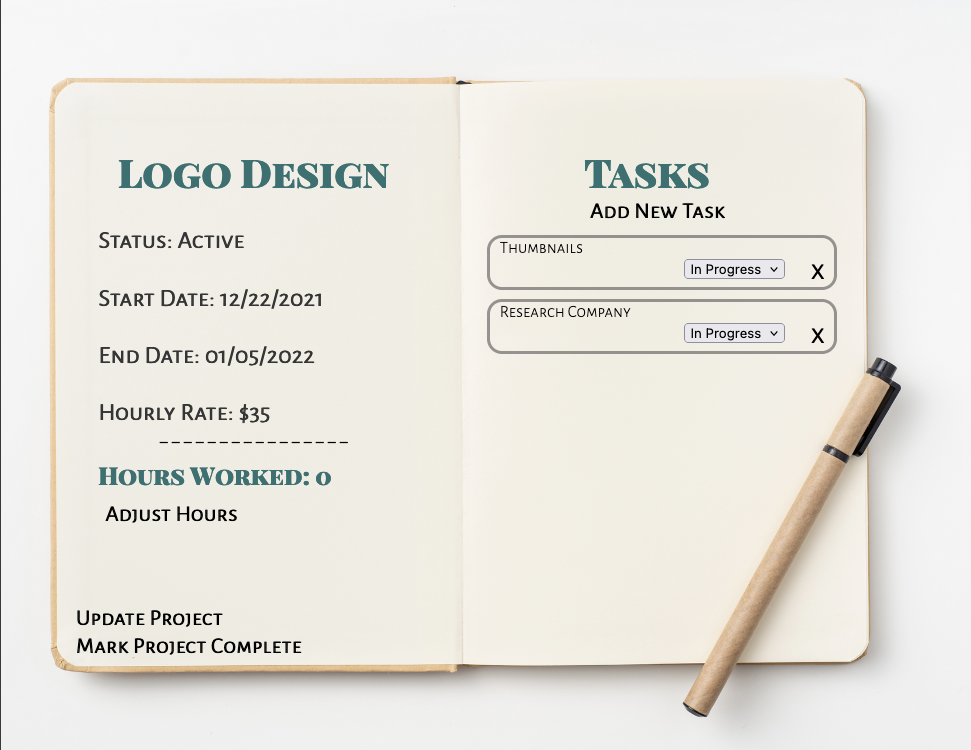

# **Folio**
 
 
 #### Self-employmnet in today's world of freelancing can be a job entirely unto itself. With Folio, the modern freelancer will gain the ability to manage multiple projects along with organizing their respective clients. The incorporated invoice feature will allow the freelancer to provide accurate rates that reflect the time and effort invested in any given project, all in order to  **make sure the price is right!**

 Link here:
 [ _Join_ **Folio** _Now_!](https://folio-front24.herokuapp.com/)
 >"Charging by the hour punishes me for being good." -- Chris Do, CEO of thefutur

 ## _Website Technologies_

This version of the app was built with **React**, **Mongoose**, **Express**, and **NodeJS** alongside the **Sass** CSS extension and the **Moment.js** package. Built with the help of _Visual Studio Code_.

## _Website Instructions_

Landing

Sign Up

Sign In

Project List

Project Details

 ## _Icebox_
 * Client Access
 * Quote Creation
 * Notes for Specific Client Needs
 * Work/Time Output